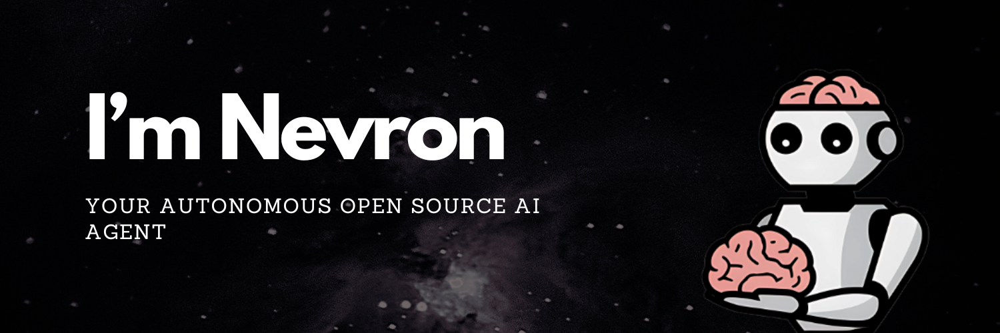
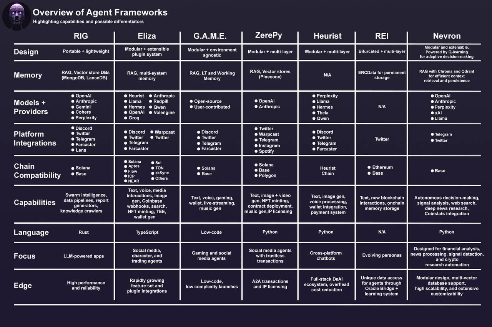

# **Developer Documentation**

Learn how to build your first Nevron, an autonomous AI agent in Python.

This framework is designed to be a modular and extensible framework for building autonomous AI agents, which can perform tasks idependently on their own.

Follow this documentation to learn how to create your first Nevron, build your own tools & workflows, and integrate with external services.

## Overview

Nevron is an open-source framework that support the development, deployment and management of autonomous AI agents.

This framework is built on top of:

- [Python](https://www.python.org/) programming language
- [Q-learning](https://en.wikipedia.org/wiki/Q-learning) algorithm for decision making
- State of the art LLM-powered intelligence
- Modular architecture with planning, feedback, and memory components
- Integration with external services (Telegram, Twitter, Discord, etc.)
- Vector-based memory storage using [Chroma](https://www.trychroma.com/) or [Qdrant](https://qdrant.tech/)

-----

## Core Features

- **Autonomous Decision Making**: Nevron uses Q-learning algorithm for intelligent decision making
- **LLM Integration**: Powered by a wide range of Large Language Models (e.g., OpenAI, Anthropic, xAI, etc.)
- **Modular Workflows**: Predefined autonomous agent task execution patterns
    - Analyze signal workflow
    - Research news workflow
- **Memory Management**: Qdrant-based vector storage for context retention
- **External Integrations**:
    - Telegram messaging
    - Twitter interaction
    - News API integration (in progress)
    - Perplexity research integration (in progress)

-----

## Nevron vs. Other Frameworks

-----

## Core Components

### 1. Planning Module
Handles decision-making using Q-learning algorithm to determine optimal actions for the agent.

- **Q-Learning**
    - Uses state-action value mapping for decision making
    - Configurable parameters:
        - Learning rate (PLANNING_ALPHA)
        - Discount factor (PLANNING_GAMMA) 
        - Exploration rate (PLANNING_EPSILON)

### 2. Memory Module
Manages agent's memory using vector storage for efficient context retrieval, which enables the agent to remember and recall previous interactions and events.

- **Multiple Vector Databases Support**
    - [Chroma](https://www.trychroma.com/) (default)
    - [Qdrant](https://qdrant.tech/) (alternative vector database)

- **Features**
    - Vector embeddings via OpenAI's [text-embedding-3-small](https://platform.openai.com/docs/guides/embeddings/what-are-embeddings) model
    - Semantic similarity search
    - Metadata storage for context
    - Configurable collection management

- **Backend**
    - Abstract memory backend interface
    - Modular backend architecture for optimal performance & customization
    - Async storage and retrieval operations

More about memory module can be found in the [Memory](agent/memory.md) section.

### 3. Feedback Module

Feedback module is responsible for processing action results and updating the Q-learning model for improved decision making.

- **Functions**
    - Collects feedback from action execution
    - Evaluates action outcomes
    - Updates Q-learning parameters
    - Maintains feedback history

- **Integration**
    - Direct integration with Planning Module
    - Performance metrics tracking

More about feedback module can be found in the [Planning](agent/planning.md) section.

### 4. Tools

Nevron supports integrations with external services and APIs for extended functionality & integrations in diferent platforms.

For development purposes, Nevron comes with a set of tools that can be used as a starting point for building your own tools and integrating more complex functionality to your AI agent.

- **Telegram**
    - Telegram Bot integration
    - Channel/group support
    - HTML message formatting

- **Twitter**
    - Tweet posting
    - Media handling
    - Thread creation

- **Research**
    - Perplexity API integration (in progress)
    - News API integration (in progress)

More about tools can be found in the [Tools](agent/tools.md) section.

### 5. LLM Integration

Powers the agent's intelligence and natural language capabilities.

- **Supported Providers**
    - OpenAI (primary)
      - gpt-4o for decision making
      - text-embedding-3-small for embeddings
    - Anthropic (alternative)

More about LLM integration can be found in the [LLM](agent/llm.md) section.

-----

## Getting Started

For setup and development instructions, please refer to our [Quickstart](quickstart.md) and setup your first AI agent in minutes.

-----

## Creators

Nevron was created by [Neurobro](https://neurobro.ai) team. If you want to learn more about Nevron, our core values & team behind it, please visit [About](about.md) page.

Support by upvoting [Nevron](https://www.producthunt.com/posts/nevron) on Product Hunt.

If you have any questions or need further assistance, please refer to the [GitHub Discussions](https://github.com/axioma-ai-labs/nevron/discussions).